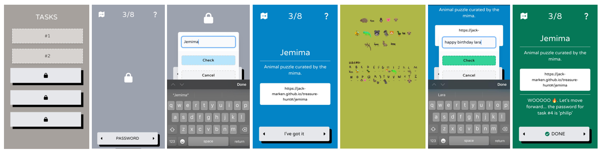

# Treasure Hunt SPA

> [!NOTE]
> This repository exists to display the source code of the program, as well as a demonstration of detailed commit message practices.
> The application requires a running instance of Supabase, which has since been frozen.

This is a single page application created as a birthday gift for my partner. The app is a treasure hunt style game in which the player unlocks challenges in a sequential order. The order of events is as follows:

1. The home screen displays a list of 8 locked (🔒) tasks.
2. A password is revealed in real life, and the player can enter this password into the program to unlock the first task.
3. The task displays a challenge for the player to complete, and the answer is revealed upon completing the challenge.
4. The player enters the answer into the "I've got it" text box, and the challenge is marked 'Complete'.
5. This might reveal the password to the next task, or it might display a 'well done' message.

This process repeats until the end of the treasure hunt, and the final birthday gift is revealed at the end.

Tech stack:
- React + TypeScript + Vite
- Tailwind
- Supabase (free postgresql database)
